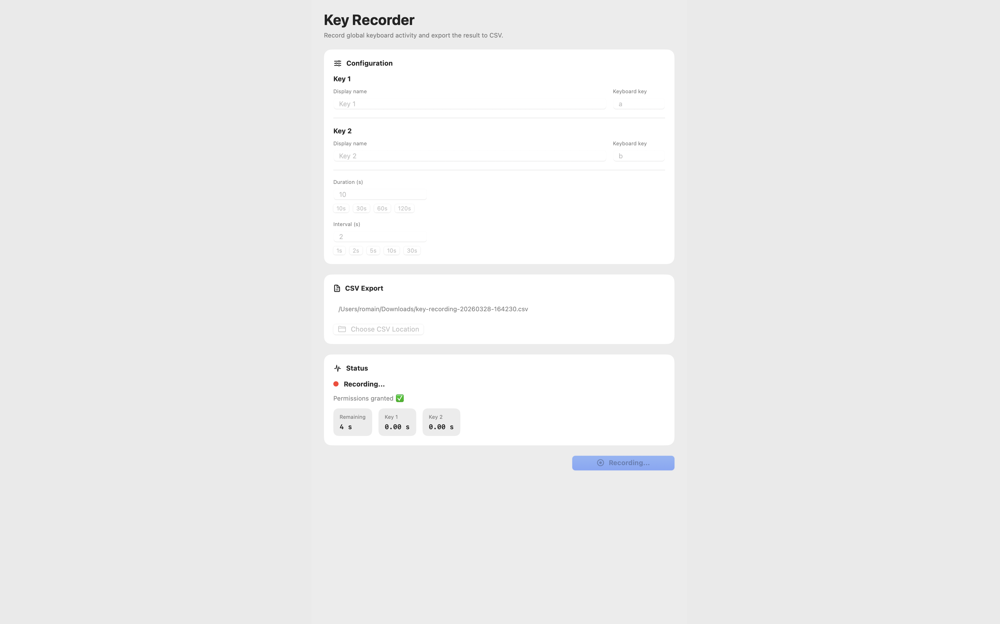

<div align="center">

# 🔑 Key Recorder

[](https://www.apple.com/macos/)
[](https://swift.org)
[](LICENSE)

**A macOS utility to measure keyboard usage patterns for productivity analysis**

<p align="center" style="margin: 16px 0;">
  <a href="https://buymeacoffee.com/romainfrezier">
    
  </a>
</p>

[Features](#features) • [Installation](#installation) • [Usage](#usage) • [Privacy](#privacy--security) • [Contribute](#contributing)



</div>

---

## 📖 Overview

Key Recorder is a privacy-focused, open-source macOS application that allows you to track and analyze your keyboard usage patterns. Whether you're conducting UX research, measuring productivity metrics, or analyzing coding habits, Key Recorder provides detailed CSV exports with interval-based duration tracking.

> ⚠️ **For legitimate use only**: This tool is designed for educational and productivity research purposes. The application requires explicit user permissions and stores all data locally.

## ✨ Features

- 🎹 **Real-time keyboard monitoring** with configurable tracking keys
- 📊 **Interval-based analysis** with custom duration and sampling intervals
- 📁 **CSV export** with detailed timestamps and duration breakdowns
- 🔒 **100% local processing** - no data ever leaves your device
- 🎨 **Native macOS UI** built with SwiftUI
- ⚙️ **Highly configurable** - track any keys, customize intervals and duration
- ✅ **Accessibility compliant** with clear permission handling
- 🧵 **Thread-safe** architecture for reliable performance

## 🚀 Installation

### Requirements

- macOS 15.1+
- Swift 5.9+
- Xcode 15.0+ (for building from source)

### Download Pre-built Release

Download the latest release from the [Releases](https://github.com/romainfrezier/key-recorder/releases) page.

### Build from Source

```bash
# Clone the repository
git clone https://github.com/romainfrezier/key-recorder.git
cd key-recorder

# Open in Xcode
open key-recorder.xcodeproj

# Build and run (⌘+R)
```

## 🎯 Use Case

**Research: Animal Behavior - Mouse Interaction Study**

Track interactions of real mice (mus musculus) in controlled behavioral experiments:

- **Objective**: Monitor mouse interactions with Object A (food dispenser) vs Object B (lever) in a maze setting
- **Setup**: Researchers press `a` key when mouse interacts with Object A (food dispenser), `b` key when mouse interacts with Object B (lever)
- **Analysis**: CSV data reveals behavioral patterns, preference scores, and interaction timing between the two objects
- **Example Output**:
  ```csv
  interval,Object A,Object B
  0s - 30s,12.45,8.32
  30s - 60s,15.67,4.21
  TOTAL,28.12,12.53
  ```
- **Research Applications**: Cognition studies, learning experiments, preference testing, pharmacological behavior studies

## 🎮 Usage
Optimize gaming or competitive skills:

**Use Case: Speed Typing Training**
- Track specific key combinations (`wasd`, skill hotkeys)
- Measure reaction times between key presses
- Analyze hand positioning through key distribution

## 🎮 Usage

### First Launch

1. Launch the application
2. Grant **Accessibility** permission when prompted (required to monitor keyboard globally)
3. Grant **Input Monitoring** permission when prompted (required to capture key events)

> 💡 **Why these permissions?** macOS requires these permissions for any app that needs to monitor keyboard input outside its own window. See our [Privacy](#privacy--security) section for details.

### Configuration

1. **Select Keys to Track**: Enter the keyboard keys you want to monitor (e.g., `a`, `b`, `space`)
2. **Set Custom Names**: Give each key a descriptive name
3. **Configure Duration**: Total recording time (default: 10 seconds)
4. **Set Interval**: Sampling interval for duration accumulation (default: 2 seconds)
5. **Choose Export Location**: Select where to save the CSV file

### Starting a Recording

1. Click **"Start Recording"** or press **Return**
2. The app will track key presses for the specified duration
3. Live statistics are displayed during recording
4. CSV is automatically exported when the session completes

### CSV Output Format

```csv
interval,Key 1,Key 2
0s - 2s,1.234,0.567
2s - 4s,0.891,1.123
4s - 6s,0.456,0.789
...

TOTAL,12.345,15.678
```

## 🔒 Privacy & Security

### Data Handling

- ✅ **No network access** - Key Recorder operates entirely offline
- ✅ **No data collection** - All information stays on your device
- ✅ **No background processes** - App only runs when you explicitly open it
- ✅ **Transparent permissions** - Explicit permission prompts before any system access

### Security Best Practices

The codebase follows industry best practices:

- 🔐 **Thread-safe queue** for keyboard event handling
- 🔐 **Permission validation** before accessing system features
- 🔐 **Minimal attack surface** - no network code, no external dependencies
- 🔐 **Transparent code** - 100% open source, auditable by anyone

**We recommend**: Always review the Permissions section in System Settings → Privacy & Security, and revoke permissions when not actively using the app.

## 🏗️ Architecture

```
key-recorder/
├── App/                            # Application entry points
│   ├── KeyRecorderApp.swift
│   └── AppDelegate.swift
├── Core/                           # Business logic
│   ├── Models/                     # Data models
│   │   ├── RecordingConfig.swift
│   │   ├── IntervalRecord.swift
│   │   └── Errors.swift
│   ├── Services/                   # Core services
│   │   ├── PermissionManager.swift  # Permission handling
│   │   ├── KeyboardMonitor.swift    # Event monitoring
│   │   ├── RecordingSession.swift   # Session management
│   │   └── CSVExporter.swift        # Data export
│   └── Utils/                      # Utilities
│       └── KeyParser.swift
└── UI/                             # User interface
    ├── Views/
    │   └── ContentView.swift
    └── ViewModels/
        └── AppState.swift
```

### Key Design Decisions

- **MainActor for UI**: All UI updates are dispatched to the main actor
- **Dedicated event queue**: Keyboard events are processed on a separate queue for performance
- **SwiftUI native**: Built entirely with native macOS UI frameworks
- **Error handling**: Comprehensive error types for all failure modes

## 🛠️ Development

### Project Structure

The project uses a feature-based organization:

- **Core/**: Business logic, models, and services
- **UI/**: SwiftUI views and view models
- **App/**: Application lifecycle and entry points

### Running Tests

```bash
# Open in Xcode and run tests (⌘+U)
open key-recorder.xcodeproj
```

### Code Style

This project follows Swift style guidelines:

- Swift 5.9+ features (async/await, actors, etc.)
- SwiftUI best practices
- Comprehensive documentation comments
- Meaningful variable names

## 🤝 Contributing

Contributions are welcome! Please see our [Contributing Guidelines](CONTRIBUTING.md) for details.

### Quick Start

1. Fork the repository
2. Create a feature branch: `git checkout -b feature/amazing-feature`
3. Commit your changes: `git commit -m 'Add amazing feature'`
4. Push to the branch: `git push origin feature/amazing-feature`
5. Open a Pull Request

### Areas for Contribution

- 🌍 Internationalization support
- 📊 Additional export formats (JSON, XML)
- 🎨 Dark mode improvements
- 🧪 Unit tests coverage
- 📖 Documentation improvements

## ☕ Support

If Key Recorder is useful to you, you can [buy me a coffee](https://buymeacoffee.com/romainfrezier).

## 📄 License

This project is licensed under the MIT License - see the [LICENSE](LICENSE) file for details.

## 🙏 Acknowledgments

- Built with [Swift](https://swift.org) and [SwiftUI](https://developer.apple.com/xcode/swiftui/)
- Inspired by productivity research tools and accessibility utilities
- Thanks to all contributors who have helped improve this project

## ⚠️ Disclaimer

This software is provided for educational and productivity research purposes only. Users are responsible for complying with all applicable laws and privacy regulations when using this tool. The authors assume no liability for misuse or damages arising from the use of this software.

---

<div align="center">

**[🌟 Star this repo](https://github.com/romainfrezier/key-recorder)** if you find it useful!

Made with ❤️

</div>
